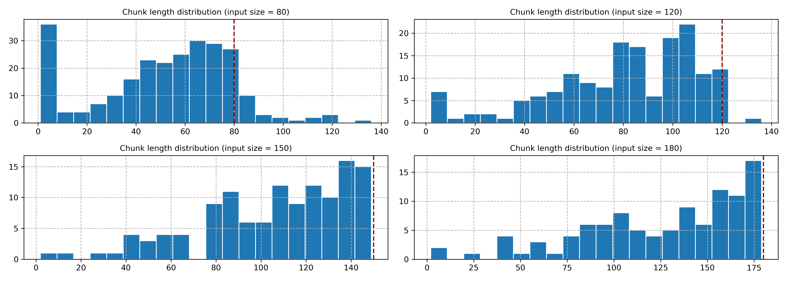

# ReRank test

- Documents are splitted into chunks for recall. 
- Chunks are sorted with a single rerank model, retrieving the top 10 chunks.
- The top 10 chunks are then evaluted via a LLM classifier. 
- Finally the evaluation scores are computed for each query against their
top 10 recall results

1. Chunking size distribution


2. Evaluation recall quality
```bash
python main.py
```

3. View results at
`./eval_runs/eval_results.json`